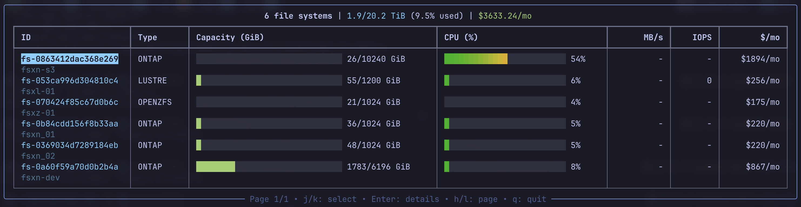
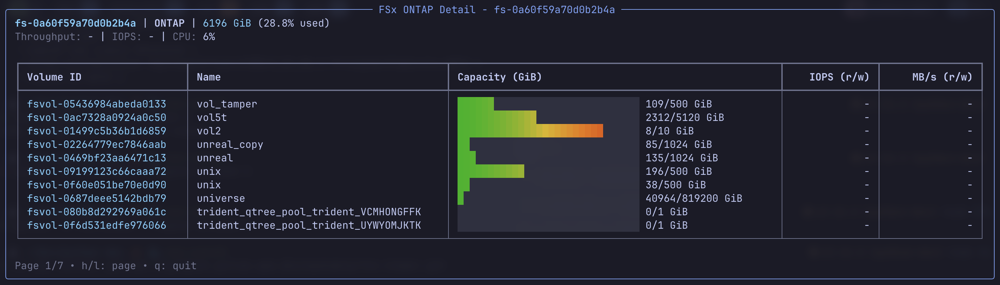
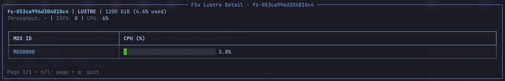

# FSx Viewer

A terminal-based monitoring tool for Amazon FSx file systems. Displays storage utilization, performance metrics, and cost information in real-time with smooth gradient progress bars.



## Features

- Real-time monitoring of all FSx file system types (Lustre, Windows, ONTAP, OpenZFS)
- Storage utilization with smooth gradient progress bars (green → yellow → orange → red)
- CloudWatch metrics (throughput, IOPS, CPU utilization)
- Estimated monthly costs based on AWS pricing
- Detail views with volume-level metrics (ONTAP/OpenZFS) and MDS CPU breakdown (Lustre)
- Filtering by type and name
- Sorting by various fields (name, capacity, utilization, cost, creation time)
- Keyboard navigation with vim-style controls
- Pagination for large datasets

## Prerequisites

- Python 3.10+
- AWS credentials configured (via environment, profile, or IAM role)
- IAM permissions:
  - `fsx:DescribeFileSystems`
  - `fsx:DescribeVolumes`
  - `cloudwatch:GetMetricData`
  - `cloudwatch:ListMetrics`

## Installation

### macOS / Linux

```bash
# Install uv (if not already installed)
curl -LsSf https://astral.sh/uv/install.sh | sh

# Install fsx-viewer
uv tool install git+ssh://git@ssh.gitlab.aws.dev/owolabip/fsx-viewer.git
```

### Windows

```powershell
# Install uv (if not already installed)
powershell -ExecutionPolicy ByPass -c "irm https://astral.sh/uv/install.ps1 | iex"

# Install fsx-viewer
uv tool install git+ssh://git@ssh.gitlab.aws.dev/owolabip/fsx-viewer.git
```

## Uninstall

```bash
uv tool uninstall fsx-viewer
```

## Development Setup

```bash
# Clone the repository
git clone git@ssh.gitlab.aws.dev:owolabip/fsx-viewer.git
cd fsx-viewer

# Install dependencies (includes dev dependencies like pytest, hypothesis)
uv sync

# Run from source
uv run fsx-viewer --region us-east-1
```

## Usage

```bash
# Run the viewer
fsx-viewer --region us-east-1

# View a specific file system in detail
fsx-viewer --region us-east-1 --file-system-id fs-0123456789abcdef0
```

### Command-line Options

```
-r, --region REGION           AWS region (required)
-p, --profile PROFILE         AWS profile name
-t, --type TYPE               Filter summary view by type: LUSTRE, WINDOWS, ONTAP, OPENZFS
-f, --file-system-id ID       Show detail view for specific file system
-n, --name-filter FILTER      Filter by name (substring match)
-s, --sort SORT               Sort field and order (e.g., 'capacity=dsc')
--refresh-interval SECS       File system refresh interval (default: 300)
--metric-interval SECS        Metrics refresh interval (default: 60)
--disable-pricing             Hide cost information
--style COLORS                Progress bar colors (good,ok,bad)
-v, --version                 Show version
```

Note: `--type` and `--file-system-id` are mutually exclusive. Use `--type` to filter the summary view, or `--file-system-id` to go directly to a detail view.

### Sort Options

Summary view:

- `name=asc` / `name=dsc` - Sort by name
- `type=asc` / `type=dsc` - Sort by file system type
- `capacity=asc` / `capacity=dsc` - Sort by storage capacity
- `utilization=asc` / `utilization=dsc` - Sort by utilization percentage
- `cost=asc` / `cost=dsc` - Sort by monthly cost
- `creation=asc` / `creation=dsc` - Sort by creation time (default: dsc)

Detail view (ONTAP/OpenZFS volumes):

- `name=asc` / `name=dsc` - Sort by volume name
- `capacity=asc` / `capacity=dsc` - Sort by volume capacity
- `utilization=asc` / `utilization=dsc` - Sort by volume utilization
- `iops=asc` / `iops=dsc` - Sort by total IOPS
- `throughput=asc` / `throughput=dsc` - Sort by total throughput

### Examples

```bash
# View all file systems in eu-west-1
fsx-viewer --region eu-west-1

# Filter to only ONTAP file systems
fsx-viewer --region us-east-1 --type ONTAP

# View details for a specific file system
fsx-viewer --region us-east-1 --file-system-id fs-0123456789abcdef0

# Sort by capacity descending
fsx-viewer --region us-east-1 --sort capacity=dsc

# Use a specific AWS profile
fsx-viewer --region us-east-1 --profile myprofile
```

## Views

### Summary View

Displays all file systems with:

- File system ID and name
- Type (LUSTRE, WINDOWS, ONTAP, OPENZFS)
- Storage capacity with utilization bar
- CPU utilization (where available)
- Throughput (MiB/s)
- IOPS
- Estimated monthly cost

Press `Enter` on a file system to view its details.

### Detail Views

**ONTAP Detail View:**



- File system overview (capacity, throughput, IOPS, CPU)
- Volume table with per-volume metrics from CloudWatch:
  - StorageUsed / StorageCapacity
  - Read/Write IOPS
  - Read/Write throughput (MiB/s)

**OpenZFS Detail View:**

- File system overview
- Volume table with:
  - Used capacity / Quota (or file system capacity if no quota)
  - Read/Write IOPS
  - Read/Write throughput (MiB/s)

**Lustre Detail View:**



- File system overview
- MDS (Metadata Server) table with CPU utilization per server

**Windows Detail View:**

- File system metrics table (capacity, CPU, throughput, IOPS)

## Keyboard Controls

### Summary View

| Key | Action |
|-----|--------|
| `j` or `↓` | Move selection down |
| `k` or `↑` | Move selection up |
| `Enter` | View details for selected file system |
| `h` or `←` | Previous page |
| `l` or `→` | Next page |
| `q` | Quit |

### Detail View

| Key | Action |
|-----|--------|
| `h` or `←` | Previous page (volumes/MDS servers) |
| `l` or `→` | Next page |
| `q` | Return to summary view |

## Configuration File

Create `~/.fsx-viewer` for default settings:

```
region=us-east-1
profile=default
refresh-interval=300
metric-interval=60
sort=capacity=dsc
disable-pricing=false
style=green,yellow,red
```

Configuration precedence: CLI args > environment variables > config file > defaults

## Performance

The tool is optimized for minimal API calls:

- Batched CloudWatch queries (single API call for all file systems/volumes)
- Shared boto3 session across clients
- Cached MDS server discovery for Lustre
- Progressive UI updates (shows data as it arrives)

## Acknowledgments

This project was inspired by [eks-node-viewer](https://github.com/awslabs/eks-node-viewer), a terminal-based tool for visualizing Kubernetes node usage. The architectural patterns (controller/model/view separation, progress bar rendering, keyboard navigation) were adapted for FSx file system monitoring.

## License

Apache 2.0

See [ATTRIBUTION.md](ATTRIBUTION.md) for third-party software licenses.
